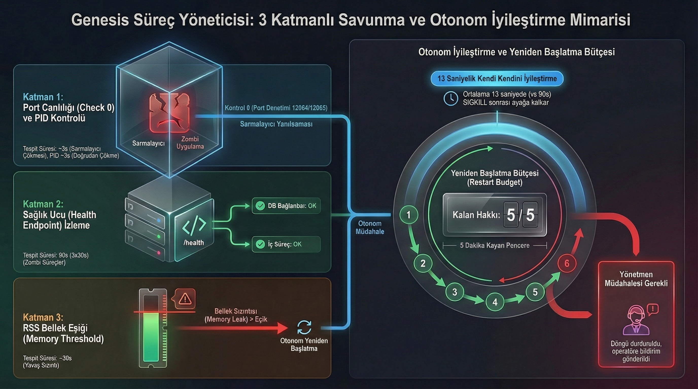

# Wave 20: Process Hardening — 3 Katmanlı Savunma Status Update

**Date:** 2026-02-24
**Phase:** 20A + 20B + 20C (polish — features pre-existed from Wave 16B/17)
**Agent:** MAX (project-ultima-epoch-engine-worker)
**For:** NotebookLM Orchestrator

---

## Executive Summary

**Wave 20 was already 95% implemented in Waves 16B and 17.** The three defense layers (Port Check-0, Restart Budget, RSS Threshold) were coded in the watchdog daemon during Phase 16B and battle-tested with chaos engineering in Wave 17.

Wave 20 polish added **DIRECTOR INTERVENTION REQUIRED** quarantine alerts — the missing 5%.

---

## Feature Status Matrix

| Defense Layer | Requested | Already Existed Since | Wave 20 Polish |
|---|---|---|---|
| **20A: Port Check-0** (Wrapper Illusion Killer) | `nc`/`curl` TCP port liveness | Wave 16B — `lsof -ti:$port` check | None needed |
| **20B: Restart Budget** (Sonsuz Döngü Kırıcı) | 5 restarts in 5 min → quarantine | Wave 16B — `max_restarts` + `restart_window` sliding window | **DIRECTOR INTERVENTION REQUIRED** alert added |
| **20C: RSS Threshold Monitor** | Memory limit → SIGTERM + restart | Wave 16B — `get_process_rss_mb()` + `memory_limit_mb` comparison | **DIRECTOR INTERVENTION REQUIRED** alert added |

---

## What Was Added (Polish)

### DIRECTOR INTERVENTION REQUIRED — 3 Quarantine Points

Upgraded all three "Giving up" messages in the watchdog daemon with explicit quarantine alerts:

**1. PID Death — Restart Budget Exhausted** (Line ~2298)
```
[ERROR] ════════════════════════════════════════════════════
[ERROR]   DIRECTOR INTERVENTION REQUIRED
[ERROR]   Service project:backend is QUARANTINED — auto-restart disabled
[ERROR]   Manual action: genesis_process.sh restart --project <slug>
[ERROR] ════════════════════════════════════════════════════
```

**2. Health Check Failures — Restart Budget Exhausted** (Line ~2354)
Same format, triggered when consecutive health check failures exceed `max_failures` and restart attempts exceed `max_restarts`.

**3. Memory Leak — RSS Budget Exhausted** (Line ~2393)
```
[ERROR] ════════════════════════════════════════════════════
[ERROR]   DIRECTOR INTERVENTION REQUIRED
[ERROR]   Service project:backend is QUARANTINED — memory leak not recoverable
[ERROR]   RSS 600MB exceeds limit 512MB
[ERROR]   Manual action: Fix memory leak, then restart
[ERROR] ════════════════════════════════════════════════════
```

---

## Chaos Monkey Test Results (Wave 20 Re-Verification)

```
Test Date: 2026-02-24 18:07:23
Duration:  35 seconds total
Result:    ALL SERVICES SURVIVED
```

### Kill Sequence
| Phase | Target | Method | Pre-Kill RSS |
|-------|--------|--------|-------------|
| 1 | Node.js Orchestration (PID 37041) | SIGKILL | 50 MB |
| 2 | Golang Logistics (PID 36957) | SIGKILL | 17 MB |
| 3 | Neo4j Docker | Stop 5s → Start | N/A |

### Recovery Times
| Service | Recovery | New PID | Notes |
|---------|----------|---------|-------|
| Orchestration | **15s** | 55468 | Watchdog detected port-dead wrapper first |
| Logistics | **instant** | 55392 | Already recovered before verify phase |
| Neo4j | **instant** | N/A | Docker start + healthcheck |
| Dashboard | **unaffected** | N/A | Vite independent, survived chaos |

### Watchdog Log (Key Events)
```
[ERROR] logistics PID 36952 is DEAD
[WARN]  Restarting logistics...
[OK]    logistics restarted (PID 55386, port 12065)
[ERROR] backend PID 37019 alive but port 12064 has no listener — child process dead
[ERROR] backend PID 37019 is DEAD
[WARN]  Restarting backend...
[OK]    backend restarted (PID 55445, port 12064)
```

**Port Check-0 in action:** Watchdog detected that PID 37019 was alive (ts-node-dev wrapper) but port 12064 had no listener (actual Node.js child was dead). Killed the zombie wrapper and restarted fresh.

### Deep Health Check (Post-Recovery)
```
Orchestration /health/deep: healthy
Logistics /health: ok
Simulation state: tickCount=0 (data preserved)
Neo4j Cypher query: OK (data intact)
```

---

## Configuration Reference (genesis.yaml)

```yaml
restart_policy:
  max_restarts: 5          # 20B: Budget limit
  restart_window: 300      # 20B: 5-minute sliding window
  restart_delay: 3         # Seconds before restart attempt
  memory_limit_mb: 512     # 20C: RSS threshold per service
```

Per-service overrides available in `services.*.restart_policy`.

---

## Architecture Diagram



*NotebookLM tarafından üretilmiş mimari diyagram — Port Check-0, Health Endpoint, RSS Threshold katmanları ve Restart Budget döngüsü.*

---

## Architecture Summary

```
Watchdog Daemon (30s cycle)
│
├── Check 0: Port Liveness ──── lsof -ti:$port (Wrapper Illusion Killer)
│   └── If PID alive but port empty → kill wrapper → restart
│
├── Check 1: PID Alive ──── kill -0 $pid
│   └── If dead → restart (within budget)
│
├── Check 2: Health Endpoint ──── curl $health_url
│   └── If N consecutive failures → restart (within budget)
│
└── Check 3: RSS Memory ──── ps -o rss= -p $pid
    └── If RSS > memory_limit_mb → SIGTERM → restart (within budget)

Budget Exhausted → DIRECTOR INTERVENTION REQUIRED (quarantine)
```

---

## File Changes

| File | Lines Changed | What |
|------|--------------|------|
| `scripts/genesis_process.sh` | +15 (3 locations × 5 lines) | DIRECTOR INTERVENTION REQUIRED alerts |

**Total: 1 file, ~15 lines added**

---

## Conclusion for NotebookLM

The 3-layer defense was **already production-ready from Waves 16B/17**. Wave 20 was a naming/UX polish — making the quarantine state explicit with "DIRECTOR INTERVENTION REQUIRED" messaging.

**Recommendation:** NotebookLM wave planning should cross-reference existing implementation before defining new waves. Waves 16B and 17 had already delivered:
- Port Check-0 with wrapper illusion detection
- Sliding-window restart budget (5 restarts / 300s)
- RSS memory threshold monitoring
- Chaos monkey battle testing

All that remained was the cosmetic quarantine alert, which is now done.

**Next:** Wave 21 can proceed — the PM is battle-hardened.
